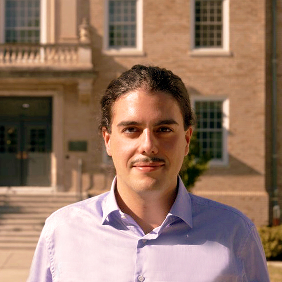

:::: {.site-layout}
::: {.profile-sidebar}


# Axel Schneider

[Predoctoral researcher<br>Cornell University]{.profile-affiliation}

```{=html}
<div class="profile-links" aria-label="Profile links">
  <a href="mailto:as4538@cornell.edu">Email</a>
  <a href="https://linkedin.com/in/axel-schneider-1798492ba">LinkedIn</a>
  <a href="https://github.com/schneideraxel">GitHub</a>
</div>
```
:::

:::: {.reading-column}
::: {#about .biography}
## About me

I’m currently a predoctoral fellow at [Cornell University](https://business.cornell.edu/centers/cider/predocs/), working with [Christopher B. Barrett](https://barrett.dyson.cornell.edu/) and [Jenny C. Aker](https://cals.cornell.edu/people/jenny-aker). I’m a development economist interested in how data fusion, alternative data sources, and AI can open up new ways to study development.

Before Cornell, I worked with [Wilson Prichard](https://munkschool.utoronto.ca/person/wilson-prichard) at the University of Toronto’s [Local Government Revenue Initiative (LoGRI)](https://logri.org/fr/profile/schneider-axel/), where I supported research and the implementation of property tax reforms. Along the way, I’ve conducted fieldwork in Sierra Leone, Togo, Kenya, and Senegal.
:::

::: {.section-grid #research}
## Research

::: {.section-body}

<details class="research-item">
<summary><span class="item-title">Climate, Mobility and Conflict: The Micro-Dynamics of Farmer-Herder Conflicts in the Sahel</span><span class="item-year">2026</span><span class="item-meta">With Jenny C. Aker and Maarten Voors · Draft in progress</span></summary>

We combine repeated village and household surveys from 180 villages in Niger with rainfall, vegetation, and geospatial data to document when and where farmer–herder conflicts occur. We focus on how seasonal mobility, access to forage and farmland, and local coordination mechanisms shape conflict risk.

</details>

<details class="research-item">
<summary><span class="item-title">Predicting Child Schistosomiasis Infection with Survey Data</span><span class="item-year">2026</span><span class="item-meta">With Christopher B. Barrett, Faraz Usmani, Molly Doruska, and Jason Rohr · Research in progress</span></summary>

We link three rounds of individual, household, and village survey data to parasitological test results for two forms of schistosomiasis. Using random forests, we ask how small a practical set of survey questions can predict infection and how performance changes across villages, over time, and as survey information becomes older.

</details>

<details class="research-item">
<summary><span class="item-title">Digital Traces, Social Networks, and Tax Compliance in Sierra Leone</span><span class="item-year">2026</span><span class="item-meta">Early-stage project</span></summary>

This early-stage project asks how the effects of tax sensitization and enforcement diffuse through social networks in Sierra Leone. It explores using machine learning to infer ties from mobile-phone communication patterns, then linking network exposure to randomized outreach and the timing of tax payments.

</details>

<details class="research-item">
<summary><span class="item-title">Efficiency of a Simplified Method of Property Tax Identification and Valuation</span><span class="item-year">2026</span><span class="item-meta">With Camille Barras, Nicolas Orgeira Pillai, Adèle Somat, Zoé Baudoin, and Evan Trowbridge · Draft in progress</span></summary>

We compare implementations of simplified property identification and valuation across five African countries, drawing on remote mapping, field survey, and expert valuation data. The brief documents the time and cost of each stage and examines how imagery quality, survey design, scale, and local conditions affect efficiency.

</details>

:::
:::

::: {.section-grid #experience}
## Experience

::: {.section-body}

### Predoctoral Research Fellow [2025–present]{.item-year}

*Cornell University · CIDER*

### Short-Term Consultant [2025]{.item-year}

*World Bank · Development Research Group*

### Predoctoral Research Fellow [2023–2025]{.item-year}

*University of Toronto · LoGRI*

:::
:::

::: {.section-grid #education}
## Education

::: {.section-body}

### MSc in Economics [2022]{.item-year}

*University of Lausanne*

Thesis supervised by [Bettina Klaus](https://www.bklaus.net/).

### BSc in Economics [2019]{.item-year}

*University of Lausanne*
:::
:::

::: {.section-grid #code}
## Code

::: {.section-body}

I build small, reusable tools for common research tasks and share them on GitHub:

### [remote-sensor](https://github.com/schneideraxel/remote-sensor) [Last updated…]{.item-year .repo-updated data-repo="remote-sensor"}

Downloads rainfall and satellite vegetation measurements for selected areas and dates from CHIRPS, Sentinel-2, and MODIS.

### [field-coordinator-bot](https://github.com/schneideraxel/field-coordinator-bot) [Last updated…]{.item-year .repo-updated data-repo="field-coordinator-bot"}

Runs data-checking scripts and sends flagged cases to GitHub Issues and Projects for fieldwork follow-up.

### [xlsform-translator](https://github.com/schneideraxel/xlsform-translator) [Last updated…]{.item-year .repo-updated data-repo="xlsform-translator"}

Adds translated language columns to XLSForm surveys while preserving variable references and HTML tags.

:::
:::
```{=html}
<script>
fetch("https://api.github.com/users/schneideraxel/repos?per_page=100")
  .then(response => response.ok ? response.json() : Promise.reject())
  .then(repositories => {
    const dates = new Map(repositories.map(repository => [repository.name, repository.pushed_at]));
    document.querySelectorAll(".repo-updated").forEach(element => {
      const date = dates.get(element.dataset.repo);
      if (date) element.textContent = `Updated ${new Intl.DateTimeFormat("en", { month: "short", year: "numeric" }).format(new Date(date))}`;
      else element.hidden = true;
    });
  })
  .catch(() => document.querySelectorAll(".repo-updated").forEach(element => element.hidden = true));
</script>
```
::::
::::
